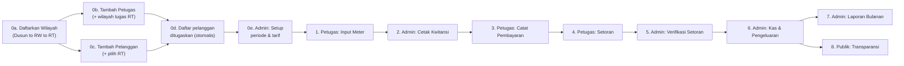

# Alur Penggunaan Aplikasi PAMSIMAS Tanjungsari

Dokumen ini menjelaskan skema penggunaan sistem secara berurutan, dari setup awal oleh Admin sampai data tampil di halaman Transparansi Publik. Tiga peran yang terlibat: **Admin**, **Petugas** (lapangan), dan **Publik** (warga, tanpa login).

## 0. Setup Awal (sekali di awal, atau saat ada data/wilayah baru)

Data dasar berikut **wajib dibuat berurutan** — setiap langkah bergantung pada langkah sebelumnya sudah ada. Semuanya dilakukan Admin.

### 0a. Daftarkan Wilayah (panel "Tambahkan Dusun, RW, RT" di halaman `Data Pelanggan`, hierarki Dusun → RW → RT)

Wilayah **tidak punya menu tersendiri** — dibuat lewat panel tambah-wilayah yang ada langsung di form tambah pelanggan pada halaman **Data Pelanggan**. Setelah dibuat, wilayah ini langsung tersedia juga sebagai pilihan "wilayah tugas" saat menambah Petugas (0b).

Wilayah berjenjang 3 level dan **harus dibuat sesuai urutan induknya**:

1. **Dusun** — tidak punya induk, dibuat pertama.
2. **RW** — wajib memilih Dusun sebagai induk (ditolak sistem kalau Dusun-nya belum ada).
3. **RT / Kampung** — wajib memilih RW sebagai induk, plus nama Kampung.

Kalau nama Dusun/RW yang sama sudah pernah dibuat, isikan nama yang **sama persis** saat menambah RT baru di dusun/RW tersebut supaya sistem tidak membuat data ganda.

### 0b. Tambahkan Petugas (`Data Petugas`)

1. Isi nama, username, nomor HP (nomor HP ini otomatis jadi **password login** petugas — kalau nomor HP diganti kemudian, password ikut berubah otomatis), dan status aktif/nonaktif.
2. **Wajib pilih wilayah tugas sampai level RT** — memilih Dusun atau RW saja (tanpa turun ke RT) akan ditolak sistem.
3. **Satu RT hanya boleh ditugaskan ke satu petugas aktif** dalam satu waktu. Kalau RT itu sudah dipegang petugas aktif lain, sistem menolak dan memberi tahu wilayah mana yang bentrok.

### 0c. Tambahkan Pelanggan (`Data Pelanggan`)

1. Pilih Dusun → RW → RT/Kampung dari data wilayah yang sudah dibuat di langkah 0a (dropdown berjenjang; kalau wilayahnya belum ada, tambahkan dulu dari panel yang sama sebelum lanjut).
2. Isi nama, alamat detail, dan status (aktif/menunggak/nonaktif).
3. Sistem membuat **kode pelanggan** otomatis berurutan.

### 0d. Bagaimana "Daftar Pelanggan yang Ditugaskan" ke Petugas Terbentuk

Ini **bukan** langkah assignment manual per-pelanggan — hubungannya otomatis dari data di atas:

> Pelanggan tersimpan dengan satu RT (0c) → Petugas ditugaskan ke satu atau lebih RT (0b) → Petugas otomatis melihat **semua pelanggan yang RT-nya masuk daftar wilayah tugasnya** di menu **Data Pelanggan** miliknya, tanpa perlu ada langkah tambahan.

Konsekuensi praktisnya: kalau pelanggan baru tidak muncul di daftar seorang petugas, penyebabnya hampir selalu salah satu dari dua hal — RT pelanggan belum diisi/salah pilih (0c), atau RT tersebut belum masuk wilayah tugas petugas itu (0b).

### 0e. Pengaturan Sistem (sekali di awal, atau saat periode/tarif berganti)

Di menu **Pengaturan Sistem**, sebelum siklus tagihan bulan berjalan dimulai:

1. **Periode Tagihan** — bulan/tahun aktif dan tanggal jatuh tempo.
2. **Tarif Air & Biaya** — tarif air per m³, biaya admin, denda keterlambatan.
3. **Penandatangan Kwitansi** — nama dan jabatan yang tampil di blok tanda tangan kwitansi cetak. Perubahan di sini hanya berlaku untuk kwitansi yang dicetak **setelah** disimpan; kwitansi yang sudah dicetak sebelumnya tidak berubah.

## 1. Petugas Mencatat Meter (`Input Meter`)

1. Petugas login, membuka **Data Pelanggan** — daftar ini otomatis terbatas hanya pelanggan di wilayah (RT) yang ditugaskan ke petugas tersebut.
2. Pilih pelanggan yang belum tercatat meternya bulan ini, buka **Input Meter**, masukkan angka meter awal dan akhir.
3. Sistem otomatis:
   - Menghitung pemakaian (m³) dan nominal tagihan (`Tagihan = pemakaian × tarif air + biaya admin`).
   - Membuat **Tagihan (Bill)** untuk periode berjalan.
   - Mengantrekan **Kwitansi** dengan status `queued`, siap dicetak Admin.

Satu pelanggan hanya bisa dicatat sekali per periode — mencoba input ulang di periode yang sama akan ditolak sistem.

## 2. Admin Mencetak Kwitansi Fisik (`Cetak Kwitansi`)

1. Admin membuka **Cetak Kwitansi**, filter berdasarkan periode dan petugas.
2. Pilih kwitansi berstatus `queued` yang siap cetak, lalu buka halaman preview cetak (`Siapkan Cetak`).
3. Preview menampilkan **3 kwitansi per halaman A4** — jumlah ini sama persis antara yang ditampilkan di layar dan yang keluar dari printer (sudah diverifikasi 1:1).
4. Klik **Cetak Sekarang** → dialog cetak browser terbuka → setelah kertas keluar, konfirmasi **"Ya, sudah dicetak"**.
5. Sistem menandai kwitansi `printed`, membekukan datanya (nominal, nama penandatangan saat itu) ke dalam snapshot kwitansi, dan menandai tagihan terkait `sudah_dicetak`.

**Penting:** pembayaran pelanggan di lapangan (langkah 3) baru bisa dicatat setelah kwitansi berstatus `printed`. Ini disengaja — mencegah petugas mencatat pembayaran untuk tagihan yang buktinya belum ada di tangan pelanggan.

## 3. Petugas Mencatat Pembayaran (`Pelanggan Bayar`)

1. Petugas membuka **Pelanggan Bayar**, memilih pelanggan yang kwitansinya sudah dicetak.
2. Catat metode bayar (Tunai/QRIS) dan unggah bukti (foto struk/QRIS).
3. Pembayaran tersimpan berstatus `pending` — uang belum dianggap resmi masuk kas sampai disetorkan dan diverifikasi (langkah 4-5).

Kalau petugas perlu mengubah data tagihan pelanggan di bulan yang salah pilih, sistem sudah menangkap periode yang sedang dilihat dengan benar (bukan periode default) — tidak perlu keluar-masuk halaman untuk berpindah bulan.

## 4. Petugas Menyetorkan Hasil Tagihan (`Setoran`)

1. Setelah beberapa pembayaran terkumpul, petugas membuka **Setoran**, memilih pembayaran-pembayaran (`pending`, belum tergabung setoran lain) dari periode yang sama.
2. Sistem menjumlahkan total tunai + QRIS otomatis, membuat **Setoran (OfficerDeposit)** berstatus `pending`, dan mengunci pembayaran-pembayaran itu ke setoran tersebut (tidak bisa disetorkan dobel).

## 5. Admin Memverifikasi Setoran (`Verifikasi Setoran`)

1. Admin membuka **Verifikasi Setoran**, meninjau detail setiap setoran (daftar pelanggan, nominal, bukti).
2. Admin bisa **menerima** seluruh setoran (`verified`) atau **menolak pembayaran tertentu** di dalamnya (`rejected`, dengan alasan) sebelum memverifikasi sisanya.
3. Begitu setoran `verified`, sistem otomatis mencatat transaksi **pemasukan kas** (Kas Tunai / Kas QRIS sesuai metode) — ini titik di mana uang resmi tercatat di kas organisasi, bukan lagi sekadar klaim petugas.

## 6. Admin Mengelola Kas (`Akun Kas` & `Pengeluaran`)

- **Akun Kas** menampilkan saldo Kas Tunai dan Kas QRIS beserta riwayat mutasi (pemasukan dari setoran terverifikasi, transfer antar-akun, pengeluaran).
- **Pengeluaran**: Admin mencatat pengeluaran (kategori, nominal, bukti nota, dan visibilitas publik). Begitu disimpan, pengeluaran langsung permanen dan langsung memotong saldo kas — tidak ada alur "posting/batalkan" terpisah. Kalau ada salah input, gunakan tombol **Edit** pada baris pengeluaran tersebut; sistem otomatis menyesuaikan selisih saldo kas sebesar delta nominal (menolak perubahan kalau saldo jadi tidak cukup).
- Pengeluaran yang ditandai **visibilitas publik** otomatis muncul di halaman Transparansi Publik (langkah 8).

## 7. Admin Membuat Laporan (`Laporan Bulanan`)

Admin membuka **Laporan Bulanan** untuk periode yang sudah selesai, sistem merangkum saldo awal, total pemasukan (setoran terverifikasi), total pengeluaran, dan saldo akhir — bisa diekspor PDF/Word untuk arsip atau pertanggungjawaban ke warga.

## 8. Publik Melihat Transparansi (`Transparansi`, tanpa login)

Warga membuka halaman publik untuk melihat ringkasan pembayaran per wilayah (RT/RW) dan daftar pengeluaran yang ditandai publik pada langkah 6 — semuanya read-only, tidak perlu akun.

## Ringkasan Urutan (satu baris per langkah)

## Catatan Perilaku Sistem yang Relevan Sehari-hari

- **Sesi login** otomatis berakhir setelah **60 menit tanpa aktivitas** — bukan 60 menit sejak login. Selama aplikasi aktif dipakai, sesi terus diperpanjang dan tidak akan logout paksa.
- **Update lintas-user** (misal Admin mengubah data yang sedang dilihat Petugas lain) muncul otomatis lewat koneksi realtime kalau tersedia. Di hosting shared cPanel, koneksi ini tidak selalu bisa menyala permanen — kalau begitu, halaman lain baru menampilkan perubahan setelah direfresh manual. Pemuatan data normal (buka halaman, submit form) tidak terpengaruh sama sekali oleh hal ini.
- Setiap tahap di atas tercatat di **Log Aktivitas** pada Dashboard Admin untuk audit (siapa melakukan apa, kapan).
